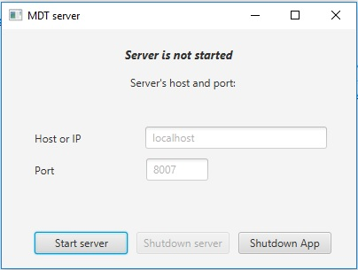

# MDTserver
Server side of client-server application "Measure Distance Traveled".

The server is implemented on the basis of Netty, 
user data is stored in the MySQL database (JDBC was used for it), 
a simple GUI allows you to start and stop the server without closing the application.

